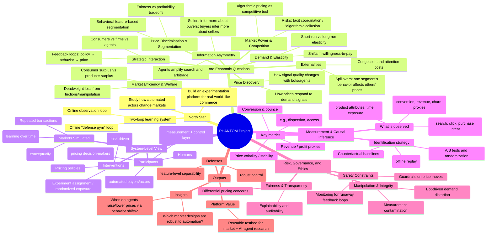

### PHANTOM

```mermaid
mindmap
  PHANTOM((PHANTOM Project))
    North Star
      Study how automated actors change markets 
      Build an experimentation platform for real-world-like commerce 
      Two-loop learning system
        Online observation loop 
        Offline "defense gym" loop 
    Core Economic Questions
      Price Discovery
        How prices respond to demand signals
        How signal quality changes with bots/agents
      Demand & Elasticity
        Shifts in willingness-to-pay
        Short-run vs long-run elasticity
      Market Efficiency & Welfare
        Consumer surplus vs producer surplus
        Deadweight loss from frictions/manipulation
      Price Discrimination & Segmentation
        Behavioral feature-based segmentation
        Fairness vs profitability tradeoffs
      Information Asymmetry
        Agents amplify search and arbitrage
        Sellers infer more about buyers; buyers infer more about sellers
      Strategic Interaction
        Consumers vs firms vs agents
        Feedback loops: policy ↔ behavior ↔ price
      Market Power & Competition
        Algorithmic pricing as competitive tool
        Risks: tacit coordination / "algorithmic collusion"
      Externalities
        Congestion and attention costs
        Spillovers: one segment’s behavior affects others’ prices
    System-Level View
      Participants
        Humans
        Agents (automated buyers/actors) 
        Firms (pricing decision-makers)
        Platform (measurement + control layer)
      Markets Simulated
        Repeated transactions
        Limited inventory / capacity constraints (conceptually)
        Time dynamics (learning over time)
      Interventions
        Pricing policies
        Experiment assignment / randomized exposure
        Agent behavioral policies (task-driven)
    Measurement & Causal Inference
      What is observed
        Actions (search, click, purchase intent)
        Context (product attributes, time, exposure)
        Outcomes (conversion, revenue, churn proxies)
      Identification strategy
        A/B tests and randomization
        Counterfactual baselines
        Robustness checks (offline replay)
      Key metrics
        Revenue / profit proxies
        Conversion & bounce
        Price volatility / stability
        Welfare proxies (e.g., dispersion, access)
    Risk, Governance, and Ethics
      Manipulation & Integrity
        Bot-driven demand distortion
        Measurement contamination
      Fairness & Transparency
        Differential pricing concerns
        Explainability and auditability
      Safety Constraints
        Guardrails on price moves
        Monitoring for runaway feedback loops
    Outputs
      Insights
        When do agents raise/lower prices via behavior shifts?
        Which market designs are robust to automation?
      Defenses
        Agent-aware pricing policies (robust control)
        Detection + mitigation strategies (feature-level separability)
      Platform Value
        Reusable testbed for market + AI-agent research
```
