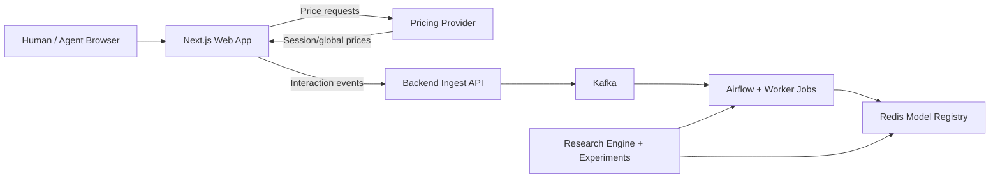

<p align="center">
  
</p>

# PHANTOM

Agent-aware dynamic pricing research platform for studying how automated transaction orchestration changes pricing power, and for testing defenses that recover margin while protecting legitimate user experience.

<p>
  <a href="https://github.com/velocitatem/PHANTOM/actions/workflows/latex.yml"></a>
  <a href="https://pub-d5b94a3c29fd40c6b3881946e463fdb7.r2.dev/thesis-latest.pdf"></a>
  <a href="https://huggingface.co/datasets/velocitatem/whoclickedit"></a>
  <a href="https://sites.research.google/trc/faq/"></a>
</p>

**Live demos:** [Hotel](https://phantom-hotel.vercel.app) | [Airline](https://phantom-airline.vercel.app) | [Academic page](https://velocitatem.github.io/PHANTOM/)

## What this repository includes

PHANTOM is a mixed research + engineering monorepo with:

- a thesis (LaTeX) formalizing Cost of Information (COI) erosion under agentic reconnaissance,
- a mode-switching web storefront (`hotel` and `airline`) for controlled human/agent interaction collection,
- backend services for event ingestion and pricing,
- an experimentation stack for benchmarks, contamination studies, and robust policy training.

## Why this matters

Dynamic pricing relies on demand signals collected during browsing. LLM-driven agents can split reconnaissance and execution into separate sessions, which weakens those signals and can collapse extractable price premium. PHANTOM exists to measure that mechanism directly and evaluate practical defenses in a controlled environment.

## Quick start (local platform)

### 1) Prerequisites

- Docker + Docker Compose
- Node.js + npm
- Python 3.8+
- `latexmk` (only if you want to build the paper locally)

### 2) Install workspace tooling and create env files

```bash
npm install
cp .env.example .env
cp .env.sweep.example .env.sweep
```

### 3) Fill required values in `.env`

At minimum, set these before starting services:

```bash
NEXT_PUBLIC_SUPABASE_URL=...
NEXT_PUBLIC_SUPABASE_ANON_KEY=...
AIRFLOW_FERNET_KEY=...
AIRFLOW_SECRET_KEY=...
```

### 4) Start the platform and web app

```bash
make platform.up
make web.dev
```

### 5) Verify

- Web app: `http://localhost:3000`
- Backend health: `http://localhost:5000/health`
- Pricing provider health: `http://localhost:5001/health`
- Airflow UI: `http://localhost:8085`
- Kafka console (Redpanda): `http://localhost:8084` (using `.env.example` defaults)

## Common commands

| Goal | Command |
| --- | --- |
| Show all available workflows | `make help` |
| Start/stop platform services | `make platform.up` / `make platform.down` |
| Stream docker logs | `make platform.logs` |
| Run backend tests | `make test.backend` |
| Run end-to-end tests | `make test.e2e` |
| Build thesis PDF | `make pdf.build` |
| Watch thesis while editing | `make pdf.watch` |
| Build general-public thesis variant | `make pdf.genpop` |
| Run quick margin-erosion study | `make study.margin-erosion.quick` |
| Run benchmark without W&B logging | `make benchmark LOCAL_BENCHMARK_ARGS='--tiers static,surge,linear --alpha-values 0.0,0.3 --episodes 3 --no-wandb'` |

## System map



## Configuration

### Core runtime (`.env`)

| Variable | Purpose | Typical value |
| --- | --- | --- |
| `STORE_MODE` | Web mode switch (`hotel` or `airline`) | `hotel` |
| `BACKEND_PORT` | Backend API port | `5000` |
| `PROVIDER_PORT` | Pricing provider port | `5001` |
| `KAFKA_HOST` | Kafka host for local runtime | `localhost` |
| `KAFKA_PORT` | Kafka external port | `9092` |
| `REDIS_PORT` | Redis exposed port | `6377` |
| `REDPANDA_CONSOLE_PORT` | Kafka console UI port | `8084` |
| `NEXT_PUBLIC_SUPABASE_URL` | Product catalog/data source URL | required |
| `NEXT_PUBLIC_SUPABASE_ANON_KEY` | Product catalog/data source key | required |
| `AIRFLOW_FERNET_KEY` | Airflow crypto key | required |
| `AIRFLOW_SECRET_KEY` | Airflow webserver secret | required |

### Training and sweep settings (`.env.sweep`)

| Variable | Purpose |
| --- | --- |
| `WANDB_API_KEY` | Required for training/benchmark runs that log to Weights & Biases |
| `WANDB_ENTITY` | Optional W&B entity override |
| `WANDB_PROJECT` | W&B project name (default: `capstone`) |
| `GITHUB_TOKEN` | Required for `make train.bootstrap` |
| `SWEEP_ID` | Required for sweep-agent workflows (`train.agent`, `benchmark.agent`) |

## Repository layout

| Path | Role |
| --- | --- |
| `paper/` | Thesis source, bibliography, and build artifacts |
| `web/` | Next.js storefront and experiment interaction surface |
| `backend/server/` | FastAPI ingestion API and product retrieval endpoints |
| `backend/provider/` | FastAPI pricing service backed by model registry data |
| `backend/worker/` | Celery worker for asynchronous jobs |
| `engine/` | Training and benchmarking entrypoints |
| `experiments/` | Data processing, ETL ideas, and analysis assets |
| `docker/` | Dockerfiles for platform services |
| `tests/e2e/` | Playwright end-to-end tests |
| `docs/` | Academic project page (GitHub Pages root) + MkDocs config |
| `docs/src/` | Markdown sources for the operator documentation site |
| `docs/documentation/` | MkDocs build output (gitignored; run `make docs.platform`; served at `/documentation/` on Pages) |
| `SETUP.md` | Unified operator guide: stack, kernels, RL training, thesis refs by chapter |

## Operational notes

- `make platform.up` starts the dockerized backend stack; the Next.js app is run separately with `make web.dev`.
- `make test.e2e` expects backend (`5000`), web (`3000`), and Airflow (`8085`) to be up.
- Research commands (`make train`, `make benchmark*`, `make train.agent`) auto-load `.env.sweep`.
- Paper builds call `paper/concat_code.sh` before compilation to flatten code into the appendix.

## Operator documentation

- Full setup guide (platform + research): [`SETUP.md`](SETUP.md)
- Hosted operator docs (after `make docs.platform`): […/PHANTOM/documentation/](https://velocitatem.github.io/PHANTOM/documentation/) on GitHub Pages

## Research artifacts

- Thesis PDF: `thesis-latest.pdf` or [hosted PDF](https://pub-d5b94a3c29fd40c6b3881946e463fdb7.r2.dev/thesis-latest.pdf)
- Public dataset: [velocitatem/whoclickedit](https://huggingface.co/datasets/velocitatem/whoclickedit)
- Project page: [velocitatem.github.io/PHANTOM](https://velocitatem.github.io/PHANTOM/)

## Acknowledgments

This work is supported by Google TPU Research Cloud resources.
