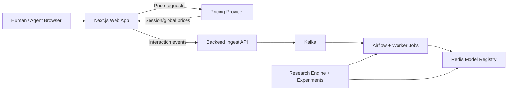

# PHANTOM: setup for operators and partners

This guide walks a team from **business context** (what you sell, how you price, what traffic you worry about) through a **running PHANTOM stack**, **behavioral kernels and contamination**, and **RL training / benchmarking**. The math lives in the thesis PDF; here we tie operations to that math without re-deriving it. References to the thesis use **chapter numbers** only (build the PDF locally if you need line-level citations).

**Thesis (PDF):** [thesis-latest.pdf](https://pub-d5b94a3c29fd40c6b3881946e463fdb7.r2.dev/thesis-latest.pdf)

---

## 1. Who this is for / prerequisites

**Audience:** Engineers and researchers who run Docker, a Next.js app, and Python tooling; product or risk stakeholders who define experiment goals and acceptable UX tradeoffs.

**Skills:** Docker Compose, Node/npm, Python 3.8+, basic Kafka/Redis mental model.

**Decide up front:**

- **Vertical vs demo:** The repo ships `hotel` and `airline` storefront modes (`STORE_MODE`). Anything beyond that is custom integration work.
- **Data residency:** Event streams and training artifacts default to paths under the repo (overridable via `PHANTOM_`* env vars in `lib/config.py`). Decide where logs and models may live before you point production-like traffic at the stack.
- **Experiment governance:** Who may run human vs agent sessions, how sessions are labeled or weak-labeled for research, and retention policy for interaction logs.

### Theoretical implications

The formal model assumes each session is generated by a latent **actor class** $Y \in H,A$ (human vs agent). Your deployment choices implicitly assert **which sessions are valid for estimating human vs agent behavior** and whether experimental conditions are stable. If you mix exploratory QA traffic with labeled experiments without recording that fact, you blur the empirical partitions $D_H$ and $D_A$ that the methodology needs for transition kernels and contamination studies. See the **Introduction** (research questions) and **Methodology**, Problem Formalization, in the thesis PDF.

---

## 2. Business fit framing

**The problem PHANTOM addresses:** Session-based pricing accumulates demand signals across a user's browsing history and raises quoted prices accordingly—the **Cost of Information (COI)** premium. LLM agents undercut this by separating reconnaissance (many isolated sessions, no signal accumulation) from execution (a clean session that quotes a floor price). The thesis proves that as the number of independent querying agents grows, the realizable price collapses to a minimum order statistic and COI approaches zero.

**What PHANTOM gives you:** A controlled platform to measure how much COI is at risk under real agent traffic, simulate that risk across contamination levels $\alpha \in [0,1]$, and train pricing policies that remain robust. The pipeline runs from raw interaction logs through behavioral kernel estimation and a contamination generator to a DR-RL gym.

**What you must supply:**

- A **product catalog** path: defaults assume Supabase-backed product data (`NEXT_PUBLIC_SUPABASE_URL`, `NEXT_PUBLIC_SUPABASE_ANON_KEY`).
- A plan for **interaction and price events** reaching the ingestion path (backend → Kafka) or an adapter you maintain.
- Clear **experiment goals:** e.g. compare human vs agent KPIs under the same task, measure margin under varying contamination $\alpha$.

### Theoretical implications

Aggregate demand in the thesis is a **mixture** over human and agent types with contamination $\alpha$ plus noise $\epsilon_t$; see the mixture demand discussion in **Chapter 3 (Methodology)**. COI is defined as $\mathbb{E}[P]-\underline{p}$; the **COI framework** and theorem in the same chapter explain why saturated agent querying collapses extractable premium. Your business scenario determines which **actions** enter $\hat{q}$ and how interpretable $\alpha$ is for your traffic.

---

## 3. Environment and secrets

**Bootstrap files (from repo root):**

```bash
npm install
cp .env.example .env
cp .env.sweep.example .env.sweep
```

**Core `.env` (platform + web + docker):** See `[.env.example](.env.example)`. You must also set the variables called out in `[README.md](README.md)` for a full stack: `NEXT_PUBLIC_SUPABASE_URL`, `NEXT_PUBLIC_SUPABASE_ANON_KEY`, `AIRFLOW_FERNET_KEY`, `AIRFLOW_SECRET_KEY` (and provider ports per your compose file).

**Training / sweeps (`.env.sweep`):** Used by `make train`, `make benchmark`, sweep agents. Typically `WANDB_API_KEY`, optional `WANDB_ENTITY` / `WANDB_PROJECT`, `GITHUB_TOKEN` for bootstrap flows, `SWEEP_ID` for W&B sweep workers. See `[.env.sweep.example](.env.sweep.example)`.

**Security:** Never commit real `.env` or `.env.sweep` files. Rotate keys if they leak.

### Theoretical implications

Splitting **online platform credentials** (ingestion, catalog, Kafka) from **offline training credentials** (W&B, cloud TPUs, GitHub tokens for workers) mirrors the **hybrid Kappa–Lambda** data loop in the thesis: streaming observation vs batch / long-running training jobs. That split is named in the **Terminology** appendix of the thesis PDF.

---

## 4. Bring-up (commands)

Aligned with `[README.md](README.md)`:

```bash
npm install
cp .env.example .env
cp .env.sweep.example .env.sweep
# edit .env: Supabase, Airflow keys, etc.

make platform.up
make web.dev
```

**Sanity checks:**


| Endpoint                                                      | Role                              |
| ------------------------------------------------------------- | --------------------------------- |
| `http://localhost:3000`                                       | Next.js storefront                |
| `http://localhost:5000/health`                                | Backend ingest API                |
| `http://localhost:5001/health`                                | Pricing provider                  |
| `http://localhost:8085`                                       | Airflow UI (default compose port) |
| `http://localhost:8084` or configured `REDPANDA_CONSOLE_PORT` | Kafka console (see your `.env`)   |


**Optional tests:** `make test.backend` (with venv/tooling as in Makefile); `make test.e2e` requires backend, web, and Airflow up per README.

### Theoretical implications

A correctly wired stack logs **trajectories** $\tau_s$ (sequences of events) and **price exposure** together. **Chapter 3** defines events $e_{s,k}=(a,i,t)$ and proxies $\hat{q}$ from weighted actions—without joint logging of behavior and quotes, you cannot recover the objects the theory reasons about (Problem Formalization).

---

## 5. Service map




**Ports (typical; confirm in `docker-compose` and `.env`):** `BACKEND_PORT` (5000), `PROVIDER_PORT` (5001), `KAFKA_PORT`, `REDIS_PORT`, Airflow `AIRFLOW_WEBSERVER_PORT` (8085 default), Redpanda console.

### Theoretical implications

The platform **observes** behavioral proxies and quoted prices, not the latent demand curve $d(p\mid\theta)$. The distinction between $\hat{q}$ and true demand is explicit in **Chapter 3**. Misattributing proxy noise to “true” elasticity breaks both estimation and any causal story about COI.

---

## 6. Tailoring to your business

**Storefront mode:** `STORE_MODE=hotel` or `airline` (see `[web/src/lib/config.ts](web/src/lib/config.ts)` and env). This switches catalog and UI, not the core ingestion pattern.

**API base / environment:** `NEXT_PUBLIC_API_BASE`, `NEXT_PUBLIC_APP_ENV` (validated in `config.ts`).

**Paths for data and runs:** Override with `PHANTOM_DATA_DIR`, `PHANTOM_SIM_RUNS_DIR`, `PHANTOM_MODEL_REGISTRY_DIR`, `PHANTOM_COLLECTED_DATA_DIR`, etc. (`[lib/config.py](lib/config.py)`).

**Scope:** A new vertical (custom product ontology, checkout rules, pricing rules) means **new UI, events, and possibly new reward features** in the engine. Budget engineering time; the repo is a research platform, not a turnkey SaaS skin for arbitrary catalogs without code changes.

### Theoretical implications

Transition kernels $\hat{\mathcal{T}}_H,\hat{\mathcal{T}}_A$ are estimated on a **finite action / state space** derived from your instrumentation. Changing catalog depth or event taxonomy changes the MDP state space; old kernel estimates are not portable. See the transition kernel discussion in **Chapter 3**.

---

## 7. Data collection and experiments

**Flow:** Browser → backend → **Kafka** → downstream consumers (Airflow DAGs, notebooks, ETL under `experiments/`). Ensure **session identity**, **item identifiers**, and **action types** are consistent enough to build trajectories.

**Weak labels:** The thesis discusses partitioning data into human vs agent subsets for MLE transition counts. In production you may only have heuristic labels—document bias explicitly.

### Theoretical implications

Distinguishability (sub-question SQ1 in the **Introduction**) asks whether $H$ vs $A$ is identifiable from behavior alone. Your labeling and experimental design determine whether $\Delta_H,\Delta_A$ and $f(\tau)$ are meaningful or dominated by noise. Symbols appear in the **Terminology** appendix ($\Delta_H,\Delta_A$, $f(\tau)$, contamination generator $\mathcal{G}(\alpha)$).

---

## 8. Transition kernels and agent scoring (theory → practice)

**Theory:** Sessions yield trajectories $\tau_s$. For each actor class $y\inH,A$, the thesis estimates a **Markov transition kernel** by counting transitions and normalizing (MLE):

$$
\hat{P}(s' \mid s) = \frac{N(s,s')}{\sum_k N(s,k)}
$$

Human and agent prototypes $\hat{\mathcal{T}}_H,\hat{\mathcal{T}}_A$ support comparing an empirical kernel from a partial trajectory to prototypes (e.g. KL-style divergences $\Delta_H,\Delta_A$) and mapping to a **weak agent probability** $f(\tau)$. See **Chapter 3** and the **Terminology** appendix.

**Code:** `[engine/lib/coi.py](engine/lib/coi.py)` (`compute_agent_probability`: empirical transition counts vs human/agent reference dicts, KL-style terms, mapped via `[lib/agent_probability.py](lib/agent_probability.py)`).

**Optional narrative:** `[blog/02-behavioral-fingerprinting.md](blog/02-behavioral-fingerprinting.md)` walks a concrete study design (not required for operators).

### Theoretical implications

If reference kernels are fit on **stale** or **mislabeled** partitions, $\Delta_H-\Delta_A$ is not interpretable as distinguishability. Ground claims in SQ1 (**Introduction**) and the kernel subsection of **Chapter 3**.

---

## 9. Contamination generator $\mathcal{G}(\alpha)$

**Theory:** Given clean trajectories, $\mathcal{G}(\alpha)$ injects synthetic agent trajectories until the effective mixture reaches contamination $\alpha\in[0,1]$, defining training scenarios for robust policies (**Chapter 3**). Catalog-scale block expansion of kernels is discussed there with validation caveats—treat large product spaces as **research-grade** until your team signs off.

**Code:** `[engine/engine.py](engine/engine.py)` — `MarketEngine` mixes human/agent demand, uses `get_adjusted_transitions` / `sample_behavior_from_transitions`, and `alpha` when combining actor types and building demand proxies (`estimate_demand`). This is the **simulator** path, not a drop-in replacement for your production database.

### Theoretical implications

$\alpha$ in mixture $Q(p)$ is **agentic demand contribution** in the formal model, not necessarily “bot share of page views” unless your instrumentation equates them. Mismeasuring $\alpha$ biases robust objectives tied to a fixed contamination level.

---

## 10. Training and evaluation — local workflow

**Environment:** Python venv via Nx (`make install` / `nx run research:install`). Training commands load `.env.sweep`.

```bash
make train LOCAL_TRAIN_ARGS='--algo ppo --total-timesteps 50000'
make benchmark LOCAL_BENCHMARK_ARGS='--tiers static,surge,linear,qtable,ppo --alpha-values 0.0,0.3 --episodes 3 --no-wandb'
make benchmark.simple
```

Entrypoints: `[engine/train.py](engine/train.py)`, `[engine/benchmark.py](engine/benchmark.py)`, `[engine/spec.py](engine/spec.py)` (Nx wraps these—see `project.json` / research targets).

**Artifacts:** `[lib/config.py](lib/config.py)` — `PHANTOM_SIM_RUNS_DIR` (default `sim/rl/runs`), `PHANTOM_MODEL_REGISTRY_DIR`, etc.

**TensorBoard (optional):** `[docker-compose.yml](docker-compose.yml)` includes `tensorboard-rl` on host port **6007** (`./sim/rl/runs`) and `tensorboard-ml` on **6006** (`./experiments/ml/runs`).

### Theoretical implications

Local runs instantiate the **offline defense gym**: policies trained on simulator-induced distributions approximate the DR-RL narrative in **Chapter 3**, but hyperparameters ($\lambda$ on COI leakage, $\eta$ on UX, robust radius) change the effective ambiguity set. Cross-check `engine/` against the thesis before claiming figure-for-figure replication.

---

## 11. Training and evaluation — remote / scaled deployment

For **research at scale** (cloud quota and secrets required):


| Mechanism                                   | Role                                                                                                                      |
| ------------------------------------------- | ------------------------------------------------------------------------------------------------------------------------- |
| `[submit_ray_job.sh](submit_ray_job.sh)`    | Ray jobs with `.env` injected; `RAY_MODE=single|distributed|benchmark|sweep`. Set the script’s `ROOT` to your clone path. |
| `make tpu.ray.bootstrap` / `tpu.ray.`*      | TPU Ray bootstrap (`TPU_CONF`, e.g. `tpu_orchestration/configs/v4_spot_us.conf`).                                         |
| `make train.agent` / `make benchmark.agent` | W&B sweeps: `SWEEP_ID` in `.env.sweep`.                                                                                   |
| `make train.bootstrap`                      | Worker bootstrap: `REPO_URL`, `SWEEP_ID`, `GITHUB_TOKEN`.                                                                 |
| `make docker.train.publish`                 | Trainer image (`TRAIN_IMAGE_REF` in Makefile).                                                                            |


See `submit_ray_job.sh` for env vars (`WANDB_*`, `PHANTOM_*` TPU toggles).

### Theoretical implications

Distributed training does not change the **definitions** of the Stackelberg game or Wasserstein ambiguity; it changes compute and variance of empirical estimates. Align random seeds and data protocol across nodes or split results explicitly—otherwise you mix distributions in a way a single empirical law $\hat{P}_N$ in the thesis does not describe.

---

## 12. Evaluation, artifacts, and audit trail

**Benchmarks:** `make benchmark`* sweeps tiers and $\alpha$; CLI includes robustness knobs (see default `BENCHMARK_ARGS` in `submit_ray_job.sh`: `--robust-radius`, `--lambda-coi`, `--eta-ux`, etc.).

**Audit trail:** Store `git` SHA, CLI argv, non-secret `.env.sweep` keys, and W&B run IDs with published tables. For scientific claims, cite **Chapters 4–5 (Results, Discussion)** in the thesis PDF.

### Theoretical implications

Evaluation quality equals **simulator fidelity** plus **contamination modeling**. Separate theorem statements (assumption-based) from empirical curves (`engine`-dependent).

---

## 13. Operational suggestions

- **Staging:** Non-production namespaces; separate Kafka topics and Supabase projects where possible.
- **Rate limits / abuse:** Protect ingest endpoints; respect participant privacy.
- **Human vs agent sessions:** Comparable cohorts; record experimental condition in metadata.
- **Contracts:** `tests/e2e/` encodes minimal flows—use when APIs change.

### Theoretical implications

Non-stationary noise $\epsilon_t$ and drifting $\alpha$ confound benchmark interpretation. **Chapter 3** discusses mixture identification: isolate treatments when possible and document confounders when not.

---

## 14. Roadmap and gaps

**In repo:** Local dockerized stack, demo verticals, engine benchmarks, documented env and paths.

**Usually custom:** Production catalog without Supabase, identity/fraud layers, legal review of logging, Kafka/Airflow SLAs, hardening the pricing provider for real money.

**Thesis vs code:** The PDF is the **spec**; not every robustness term or large-catalog kernel construction is production-verified—see caveats in **Chapter 3**.

### Theoretical implications

Theorems in the thesis can be **stronger** than what observational firm logs support. The COI result assumes a clean experimental reading of the pricing policy; live market data may only support weaker claims.

---

## 15. Theory and thesis cross-references (quick index)

Use the **PDF table of contents** with these anchors:


| Topic                                                                      | Thesis location                                       |
| -------------------------------------------------------------------------- | ----------------------------------------------------- |
| Research questions (margin, distinguishability, contamination, mitigation) | **Introduction**                                      |
| Sessions, events, $\hat{q}$, mixture $Q(p)$, $\alpha$                      | **Chapter 3** — Problem Formalization, mixture demand |
| COI definition and erosion theorem                                         | **Chapter 3** — COI framework                         |
| Transition kernels, MLE, $\mathcal{G}(\alpha)$                             | **Chapter 3**                                         |
| DR-RL, ambiguity sets, Stackelberg                                         | **Chapter 3**                                         |
| Symbol glossary (COI leakage, $f(\tau)$, UX, surrogates)                   | **Appendix — Terminology**                            |
| Empirical results and limitations                                          | **Chapters 4–5**                                      |


---

## 16. Quick file index (code)


| File                                                                               | Role                                               |
| ---------------------------------------------------------------------------------- | -------------------------------------------------- |
| `[engine/lib/coi.py](engine/lib/coi.py)`                                           | KL-style trajectory comparison; agent probability. |
| `[engine/engine.py](engine/engine.py)`                                             | `MarketEngine`, mixture, demand proxy path.        |
| `[lib/agent_probability.py](lib/agent_probability.py)`                             | Divergence → probability score.                    |
| `[lib/config.py](lib/config.py)`                                                   | Paths and ports for artifacts.                     |
| `[engine/train.py](engine/train.py)`, `[engine/benchmark.py](engine/benchmark.py)` | CLI entrypoints.                                   |
| `[tpu_orchestration/](tpu_orchestration/)`                                         | TPU configs and helpers.                           |


Many offline benchmarks run without a storefront once the research Python environment is installed; connecting production trajectories to kernel estimation still requires aligned instrumentation.