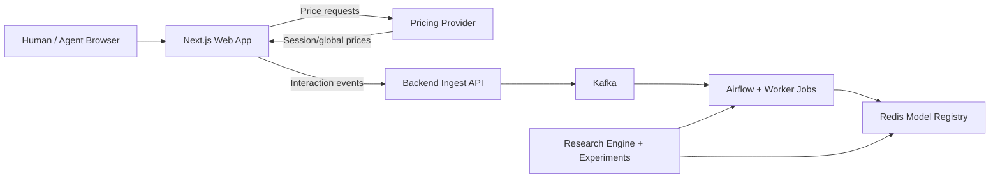

# Architecture

## System map

## Event and training path (conceptual)

1. **Online:** The browser emits events; the backend publishes to **Kafka**; schedulers and workers consume for ETL and model registry updates.
2. **Offline:** Notebooks and scripts under `experiments/` transform logs; `**engine/`** runs simulations, training, and benchmarks; artifacts land under paths from `[lib/config.py](https://github.com/velocitatem/PHANTOM/blob/main/lib/config.py)`.
3. **Feedback:** Trained or rule-based policies surface through the **pricing provider** to the web app.

## Where to read more

- Ports and health checks: [README](https://github.com/velocitatem/PHANTOM/blob/main/README.md) and [Configuration](configuration.md).
- Formal notation for sessions, $\hat{q}$, and mixture demand: **Chapter 3 (Methodology)** in the thesis PDF.

